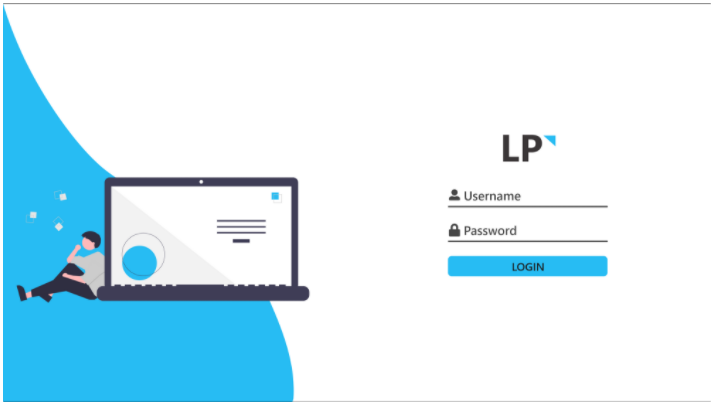
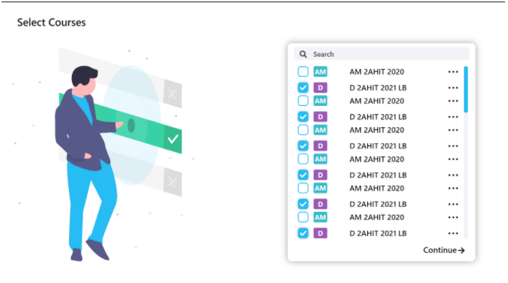

## Login

After installing the app, the first step is to log in. You use your username and password, which are also used for Moodle (e-learning).

## Course selection

After registering, you select the courses you want to include in your schedule.

